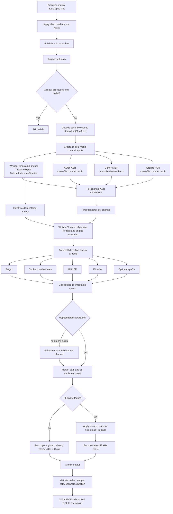

# AMC PII Audio Masking Pipeline

Fast, resumable speech PII masking pipeline for stereo AMC call audio.

Final output is enforced as:

```text
codec: Opus
sample rate: 48 kHz
channels: 2
container: .opus
```

The pipeline transcribes each call, forced-aligns the selected transcripts with WhisperX, detects PII in the transcript text, maps detected entities to aligned word timestamps, masks only the required audio spans, and writes the masked audio back in the same required format.

## What is optimized now

This version uses batching at every practical layer:

| Layer | What is batched | Config |
|---|---|---|
| File scheduler | Multiple files per processing micro-batch | `runtime.file_batch_size` |
| Whisper | faster-whisper internal segment batching | `asr.engines.whisper.use_batched_pipeline`, `asr.engines.whisper.batch_size` |
| Qwen | file-channel WAVs across the micro-batch | `asr.engines.qwen.batch_size` |
| Cohere | file-channel WAVs across the micro-batch | `asr.engines.cohere.batch_size` |
| Granite | file-channel WAVs across the micro-batch | `asr.engines.granite.batch_size` |
| Forced alignment | final and per-engine transcripts before PII span mapping | `alignment.enabled`, `alignment.backend` |
| PII detection | all final and per-engine transcripts across the micro-batch | `pii.batch_size` |
| Corpus scale-out | one process per shard or GPU | `runtime.shard_count`, `runtime.shard_index` |

Important detail: Whisper is not cross-file batched because it is the timestamp anchor and faster-whisper does not reliably accept independent audio arrays as one list input. It uses `BatchedInferencePipeline`, which batches internal chunks. Qwen, Cohere, Granite, and neural PII detection are cross-file batched.

For very large single-GPU jobs, `runtime.pipeline_schedule: model_major` is also available. It runs one ASR model across the corpus, saves that model's per-channel transcripts/timestamps in SQLite, unloads and clears accelerator memory, then runs the next model. After all ASR passes complete, the pipeline builds consensus, detects PII, and masks audio from the cached ASR results.

## Pipeline flow



## Four-ASR ensemble

Enabled engines are configured here:

```yaml
asr:
  engine_order: [whisper, qwen, cohere, granite]
  timestamp_anchor_engine: whisper
  pii_detection_transcript_scope: final_and_all_engines

  engines:
    whisper:
      enabled: true
      kind: faster_whisper
      model_dir: /mnt/amc-data/pipeline/models/whisper-large-v3
      use_batched_pipeline: true
      batch_size: 8
      beam_size: 1
      word_timestamps: true

    qwen:
      enabled: true
      kind: qwen
      model_dir: /mnt/amc-data/pipeline/models/qwen3-asr-1.7b
      batch_size: 2

    cohere:
      enabled: true
      kind: cohere
      model_dir: /mnt/amc-data/pipeline/models/cohere-transcribe-03-2026
      batch_size: 2

    granite:
      enabled: true
      kind: granite
      model_dir: /mnt/amc-data/pipeline/models/granite-4.0-1b-speech
      batch_size: 2
```

Whisper supplies timestamps. The other engines improve recall. PII detection runs on the final consensus plus each enabled engine transcript by default.

## Install

```bash
cd amc_pii_audio_masking_pipeline_v5_batch_optimized
pip install -r requirements.txt
cp config.example.yaml config.yaml
```

Optional dependencies depend on your local model setup:

```text
whisperx for forced alignment
qwen_asr package exposing Qwen3ASRModel
local Cohere speech model code if required by your model folder
local Granite speech model code if required by your model folder
spacy + en_core_web_sm only when pii.enable_spacy=true
```

Install WhisperX on the server before using the default alignment config:

```bash
python3 -m pip install whisperx
python3 - <<'PY'
import whisperx
print("whisperx import ok", getattr(whisperx, "__version__", "unknown"))
PY
```

Because `alignment.enabled` is `true` by default, startup fails with a clear install message if `whisperx` is not importable. Set `alignment.enabled: false` only for a temporary ASR-timestamp fallback run.

## Run

Small validation run:

```bash
python -m pii_audio_masking_pipeline.run \
  --config config.yaml \
  --stage process \
  --limit 25
```

Use only Whisper for smoke testing:

```bash
python -m pii_audio_masking_pipeline.run \
  --config config.yaml \
  --stage process \
  --limit 10 \
  --enable-asr-engines whisper
```

Production-style run with four engines and file batching:

```bash
python -m pii_audio_masking_pipeline.run \
  --config config.yaml \
  --stage process \
  --enable-asr-engines whisper,qwen,cohere,granite \
  --file-batch-size 2
```

For short clips or already-segmented audio, try a larger file batch:

```bash
python -m pii_audio_masking_pipeline.run \
  --config config.yaml \
  --stage process \
  --file-batch-size 8 \
  --file-batch-max-decoded-audio-gb 4
```

For long full-call audio, keep `file_batch_size` at `1` or `2`. Decoded stereo 48 kHz float32 buffers are held until the micro-batch is finalized.

## Recommended speed config

```yaml
asr:
  mode: per_channel
  input_audio_strategy: single_decode
  model_residency: keep_loaded
  pii_detection_transcript_scope: final_and_all_engines
  engines:
    whisper:
      enabled: true
      use_batched_pipeline: true
      batch_size: 8
      beam_size: 1
      best_of: 1
      vad_filter: true
      word_timestamps: true
      condition_on_previous_text: false
    qwen:
      enabled: true
      batch_size: 2
    cohere:
      enabled: true
      batch_size: 2
    granite:
      enabled: true
      batch_size: 2

pii:
  batch_size: 16
  enable_regex: true
  enable_spoken_number_rules: true
  enable_gliner: true
  enable_piiranha: true

alignment:
  enabled: true
  backend: whisperx
  device: auto
  compute_type: float16
  batch_size: 16
  on_failure: fallback_full_channel
  min_aligned_words_ratio: 0.70

masking:
  mode: silence
  copy_input_if_no_pii: true
  unmapped_entity_policy: mask_full_channel

runtime:
  performance_profile: default
  pipeline_schedule: file_major
  file_batch_size: 2
  file_batch_max_decoded_audio_gb: 2.0
  adaptive_file_batching: true
  adaptive_batch_min_size: 1
  min_free_gpu_mem_gb: 2.0
  write_perf_metrics: false
  copy_unmasked_when_no_pii: true
  unmasked_copy_method: hardlink_or_copy
  atomic_output: true
  validate_outputs: true
```

For a mostly free NVIDIA A10G 24 GB worker, use the built-in profile:

```bash
python -m pii_audio_masking_pipeline.run \
  --config config.yaml \
  --stage process \
  --performance-profile a10g_24gb
```

The A10G profile keeps all models loaded, starts `file_batch_size` at `4`, raises the decoded-audio guard to `4 GB`, increases transcript-only ASR batches to at least `4`, increases PII batch size to `32`, enables performance metrics, and keeps adaptive batching on. If VRAM gets tight, adaptive batching shrinks file micro-batches before the next batch.

For the lower-VRAM model-major schedule:

```bash
python -m pii_audio_masking_pipeline.run \
  --config config.yaml \
  --stage process \
  --performance-profile a10g_24gb \
  --pipeline-schedule model_major
```

This creates `asr_results_shard*_of_*.sqlite` under `paths.work_dir` and resumes individual model/channel ASR results on rerun.
That cache contains raw ASR transcripts, so it is created with private file permissions. Add `--delete-asr-cache-after-finalize` or set `runtime.delete_asr_cache_after_finalize: true` when you do not need to keep it for crash recovery.

To benchmark batch sizes without editing config:

```bash
python scripts/benchmark_matrix.py \
  --config config.yaml \
  --limit 25 \
  --batch-sizes 1,2,4,8 \
  --performance-profile a10g_24gb
```

## Sharding

Run one worker per GPU or machine:

```bash
python -m pii_audio_masking_pipeline.run --config config.yaml --stage process --shard-count 4 --shard-index 0
python -m pii_audio_masking_pipeline.run --config config.yaml --stage process --shard-count 4 --shard-index 1
python -m pii_audio_masking_pipeline.run --config config.yaml --stage process --shard-count 4 --shard-index 2
python -m pii_audio_masking_pipeline.run --config config.yaml --stage process --shard-count 4 --shard-index 3
```

Do not run multiple four-model workers on one small GPU. That usually reduces throughput or causes OOM.

## Output sidecar

Every output gets:

```text
<masked_audio>.pii_masking.json
```

The sidecar includes input metadata, consensus transcripts, per-engine transcripts, PII entities, raw spans, merged spans, validation, forced-alignment audit, and optimization flags. Transcript rows include word-level confidence when the ASR/alignment backend provides it, plus a `transcript_confidence` summary computed from word probabilities. Alignment fields show `alignment_status`, `alignment_backend`, `alignment_coverage`, and whether spans came from `forced_alignment` or full-channel fallback. PII audit fields show which detector found each entity (`source`), which ASR transcript it came from (`asr_engine` / `transcript_source`), and whether every detected entity was covered by timestamp masking or full-channel fallback.

Word details are enabled by default for auditability:

```yaml
runtime:
  sidecar_include_words: true
```

## Validation and safety guards

The pipeline validates:

```text
codec_name == opus
sample_rate == 48000
channels == 2
duration close to input duration
```

It also refuses unsafe output paths, excludes output/work directories from discovery, disallows symlink outputs, uses atomic writes, and masks the full detected channel if PII is found but cannot be timestamp-mapped.

## Tests

```bash
PYTEST_DISABLE_PLUGIN_AUTOLOAD=1 pytest -q
```

Expected packaged validation result when FFmpeg/ffprobe are available:

```text
24 passed
```

## Tuning order

1. Start with `file_batch_size: 2` and all four ASR engines enabled.
2. Benchmark 100 representative calls.
3. Increase Qwen/Cohere/Granite `batch_size` first.
4. Increase `runtime.file_batch_size` only if RAM stays comfortable.
5. Increase Whisper `batch_size` only if GPU memory allows it.
6. Keep Whisper `beam_size: 1` for production masking throughput.
7. Use `silence` for final ASR training data and `beep` only for audit samples.
