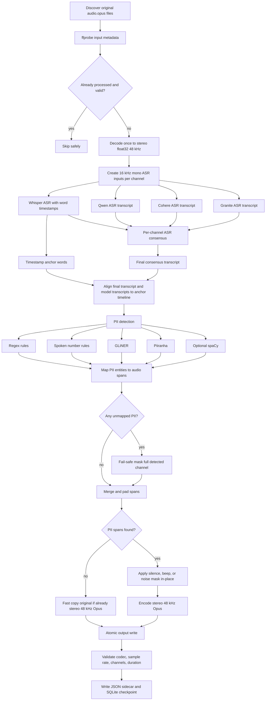

# AMC PII Audio Masking Pipeline

Fast, resumable pipeline for masking personally identifiable information in stereo call audio while preserving the required output format:

```text
codec: Opus
sample rate: 48 kHz
channels: 2
container: .opus
```

The pipeline now uses a configurable **four-ASR ensemble**:

1. faster-whisper large-v3
2. Qwen ASR
3. Cohere ASR
4. Granite speech

Each model can be enabled or disabled in `config.yaml`. Whisper remains the timestamp anchor because audio masking needs word timestamps. The other ASR models improve transcript quality and PII recall.

## Pipeline flow



## Why four ASR models are used

A single ASR model can miss spoken PII. This is especially risky for phone numbers, member IDs, names, addresses, and dates of birth. The final pipeline handles this by separating two jobs:

```text
Whisper:
  transcript + word timestamps
  used as the timing anchor

Qwen, Cohere, Granite:
  transcript only
  used to improve final transcript and PII recall
```

PII detection is run over the final consensus transcript and, by default, every enabled ASR transcript. This is safer than only detecting PII on the final transcript because a minority ASR model may catch an identifier that the consensus text smooths over.

## ASR consensus logic

For each channel:

1. Normalize transcripts from enabled engines.
2. Accept strict majority when at least `min_agreement` engines agree.
3. Otherwise choose the soft-similarity center transcript when agreement is good enough.
4. Otherwise choose the first non-empty transcript from `fallback_priority`.
5. Run PII detection on the selected final transcript and optionally all enabled model transcripts.
6. Project PII spans back to Whisper word timestamps.
7. If an entity cannot be mapped to timestamps, mask the full detected channel by default.

This is intentionally conservative. For de-identification, a false negative is worse than masking too much audio.

## Directory layout

```text
amc_pii_audio_masking_pipeline_v4_multiasr_optimized/
  pii_audio_masking_pipeline/
    asr.py                  # Multi-ASR engines, consensus, timestamp alignment
    audio_io.py             # FFmpeg decode, encode, masking, copy fast paths
    config.py               # Config dataclasses and validation
    manifest.py             # Audio discovery
    pii_detection.py        # Regex, spoken number, GLiNER, Piiranha, spaCy
    pipeline.py             # End-to-end file processor
    run.py                  # CLI entry point
    state.py                # SQLite resume state
    timestamp_mapping.py    # Entity-to-word timestamp mapping
    validation.py           # Output validation
  tests/
  config.example.yaml
  requirements.txt
  OPTIMIZATION_NOTES.md
  VERSION.txt
```

## Install

```bash
cd amc_pii_audio_masking_pipeline_v4_multiasr_optimized
pip install -r requirements.txt
```

Optional model-specific dependencies must already be available for the enabled engines:

```text
whisper: faster-whisper
qwen: local qwen_asr package exposing Qwen3ASRModel
cohere: transformers build that supports Cohere ASR
Granite: transformers build and local Granite speech model with trust_remote_code support
```

Disable engines that are not installed or not available locally.

## First run

```bash
cp config.example.yaml config.yaml

python -m pii_audio_masking_pipeline.run \
  --config config.yaml \
  --stage process \
  --limit 25
```

## Enable or disable ASR models

Edit `config.yaml`:

```yaml
asr:
  engines:
    whisper:
      enabled: true
    qwen:
      enabled: true
    cohere:
      enabled: true
    granite:
      enabled: true
```

Or use CLI overrides:

```bash
python -m pii_audio_masking_pipeline.run \
  --config config.yaml \
  --stage process \
  --enable-asr-engines whisper,qwen,cohere,granite
```

For a faster smoke test using only Whisper:

```bash
python -m pii_audio_masking_pipeline.run \
  --config config.yaml \
  --stage process \
  --limit 10 \
  --enable-asr-engines whisper
```

Keep `whisper` enabled unless another timestamp-capable engine is implemented. The masking stage needs word timestamps.

## Important speed settings

Recommended default for a large GPU:

```yaml
asr:
  input_audio_strategy: single_decode
  model_residency: keep_loaded
  pii_detection_transcript_scope: final_and_all_engines
  engines:
    whisper:
      batch_size: 8
      beam_size: 1
      vad_filter: true
    qwen:
      batch_size: 2
    cohere:
      batch_size: 2
    granite:
      batch_size: 2

pii:
  batch_size: 16

masking:
  mode: silence
  copy_input_if_no_pii: true

runtime:
  copy_unmasked_when_no_pii: true
  unmasked_copy_method: hardlink_or_copy
  atomic_output: true
```

For small GPUs where four models cannot stay resident:

```yaml
asr:
  model_residency: unload_after_file
```

That is slower, but avoids GPU out-of-memory failures.

## Output sidecar

For each output audio file, the pipeline writes:

```text
<masked_audio>.pii_masking.json
```

The sidecar contains:

```text
input metadata
final consensus transcript per channel
per-engine transcripts and errors
consensus method
PII entities
raw mask spans
merged mask spans
output validation result
optimization flags
```

Set this only for debugging because sidecars become large:

```yaml
runtime:
  sidecar_include_words: true
```

## Output validation

Every generated output is validated with ffprobe:

```text
codec_name == opus
sample_rate == 48000
channels == 2
duration close to input duration
```

The pipeline refuses unsafe configs where `output_root` equals `input_root`, and it excludes output/work directories from input discovery.

## Sharding

Run one shard per worker:

```bash
python -m pii_audio_masking_pipeline.run --config config.yaml --stage process --shard-count 4 --shard-index 0
python -m pii_audio_masking_pipeline.run --config config.yaml --stage process --shard-count 4 --shard-index 1
python -m pii_audio_masking_pipeline.run --config config.yaml --stage process --shard-count 4 --shard-index 2
python -m pii_audio_masking_pipeline.run --config config.yaml --stage process --shard-count 4 --shard-index 3
```

Use one worker per GPU when all four ASR models are enabled.

## Tests

```bash
PYTEST_DISABLE_PLUGIN_AUTOLOAD=1 pytest -q
```

Expected result in the packaged validation run:

```text
14 passed
```

## Hard constraints

- Do not disable word timestamps on the timestamp anchor.
- Do not set `unmapped_entity_policy: copy_original` for production de-identification.
- Do not output symlinks for deliverable masked audio.
- Do not process masked output directories as input.
- Do not expect transcript-only ASR models to provide accurate masking timestamps. They improve PII text detection, while Whisper supplies timing.
